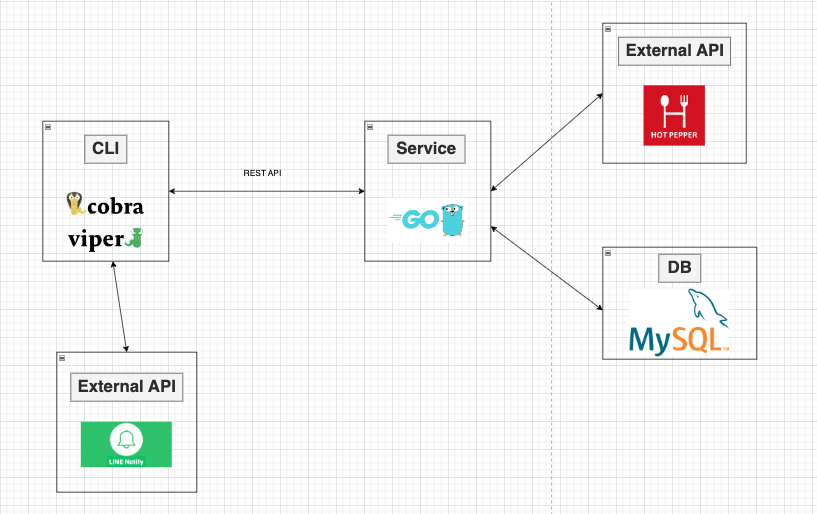

<p align="center">
  
</p>

## アプリ概要

エンジニアとして活動している人たちが、何かご飯を食べたいと思った時に、ブラウザを開かずともすぐさま飲食店を検索できるCLIアプリです。以下の機能を提供しています。

- 飲食店検索機能
- 飲食店 LINE 通知機能
- 飲食店お気に入り管理機能
- OAuth2 による認可・認証機能

## docs

- API 定義はこちら
  - [pecopeco-api-docs](https://taga3s.github.io/pecopeco/)

## 技術選定

### 言語

- [Go](https://go.dev/)

### フレームワーク

- [Cobra](https://cobra.dev/)
- [Viper](https://github.com/spf13/viper)

CLI の実装のために、Cobra と Viper を利用する。以下の 2 つのポイントから、それぞれ選定した。

1. Cobra は、CLI 実装のための機能を多く提供している。そのため、実装を比較的容易に進めることができ、その分 API 実装の方により工数をかけられる。
2. Viper により、CLI アプリケーションの環境の設定を柔軟に行える。

### DB

- [PlanetScale](https://planetscale.com/)

DB に、PlanetScale を利用する。PlanetScale は MySQL のサーバーレスプラットフォームである。  
以下の 3 つのポイントから選定した。

1. 無料枠で月に 5GB のストレージ、10 億行の読み取り、1 千万行の書き込みが提供されている。
2. スキーマの変更やデプロイが容易に行える。
3. NoSQL のような高パフォーマンスは求められないため、データの整合性を重視し RDB を利用したいため。

### API

- REST API

API に、REST API を利用する。以下の 2 つのポイントから選定した。

- HTTP ベースで、JSON を用いるといった主流な Web 技術を利用するためシンプルに構築できる。
- gRPC も型安全に開発を行える点で検討したが、学習コストが高いことや、今回マイクロサービスの実装を行わないため不採用にした。

### 外部 API

- [ホットペッパー API](https://webservice.recruit.co.jp/doc/hotpepper/reference.html)
- [LINE Notify API](https://notify-bot.line.me/doc/ja/)

外部 API に、ホットペッパー API と LINE Notify API を利用する。  
以下の 2 つのポイントから、それぞれ選定した。

1. ホットペッパー API は、多くの飲食店情報を提供する。
2. LINE Notify API を利用することで、ユーザーがトークンを発行し、任意のグループ等と連携を行うことで、LINE に通知することができる。他の LINE Messaging API や LINE ミニアプリの作成と比較したが、通知を送れればよいという要件や、LINE ミニアプリの作成の場合の認証周りの実装の大変さや審査に時間がかかることを踏まえれば、これが適切だと判断した。

## システム構成図



### 開発環境

- [Docker](https://docs.docker.com/)

## 環境構築

### 共通事項

1.  `/cli`と`/service`にある`.env.example`をそれぞれコピーして、`.env`として配置します。

```sh
cp .env.example .env
```

2. cli, api, db のコンテナを全て起動します。

```sh
make run
```

### cli, api コンテナに接続し、Go を実行する

1. コンテナに接続します。

```sh
make it-cli
```

or

```sh
make it-api
```

2. main.go を実行します。

```sh
go run main.go
```

### db コンテナに接続し、mysql に root ユーザとしてログインする

1. コンテナに接続します。

```sh
make it-db
```

2. mysql に root ユーザとしてログインします。

```sh
mysql -uroot -ppeco_password
```
