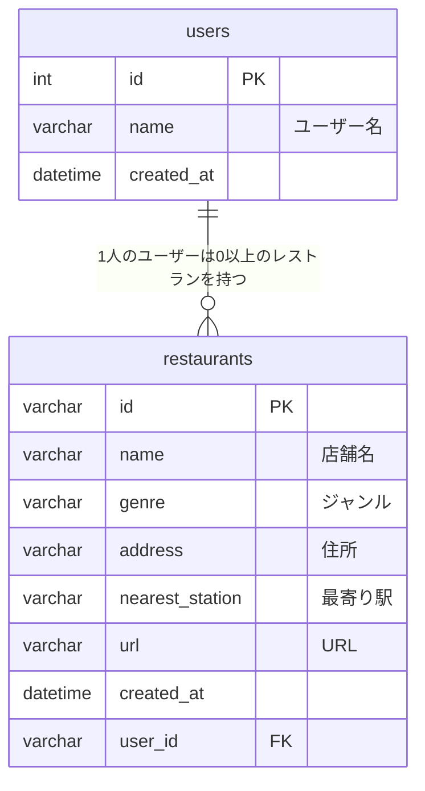

```mermaid
erDiagram
  users {
    int id PK
    varchar name "ユーザー名"
    datetime created_at
  }
  restaurants {
    varchar id PK
    varchar name "店舗名"
    varchar genre "ジャンル"
    varchar address "住所"
    varchar nearest_station "最寄り駅"
    varchar url  "URL"
    datetime created_at
    varchar user_id FK
  }
  users ||--o{ restaurants : "1人のユーザーは0以上のレストランを持つ"
```
